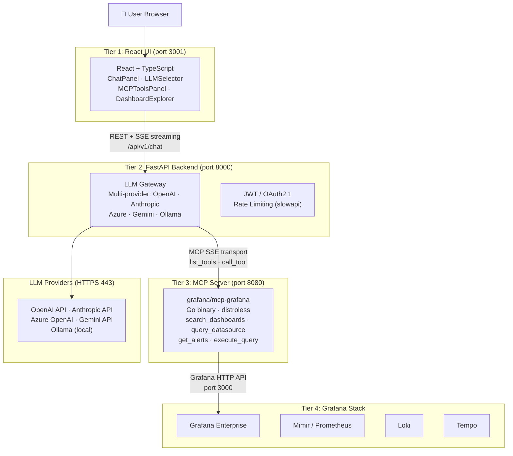
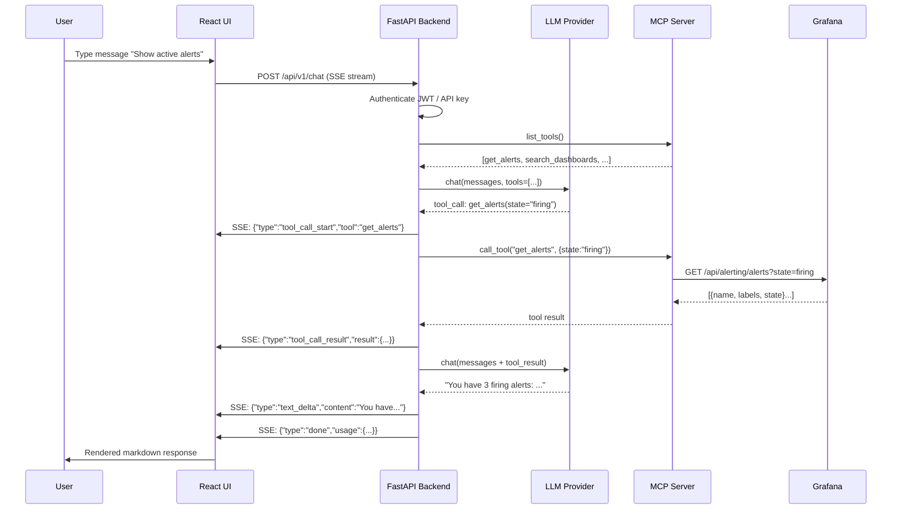
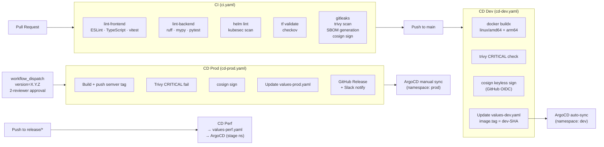
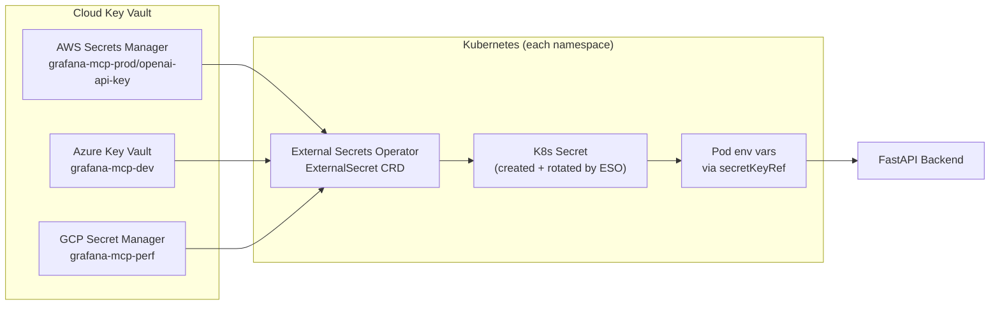

# Architecture — Grafana MCP Platform

## System Overview

The Grafana MCP Platform is a 4-tier AI-powered observability assistant that connects users to their Grafana stack via the Model Context Protocol.



## Chat Request Flow (Agentic Loop)



## CI/CD Pipeline Flow



## Secret Management Flow



## Network Policy Diagram

```
Internet
    │
    ▼
[Ingress Controller (ingress-nginx)]
    │
    ▼ (allowed)
[frontend pod :3001]
    │
    ▼ (allowed: port 8000)
[backend pod :8000] ──→ LLM APIs (HTTPS 443, external only)
    │
    ▼ (allowed: port 8080)
[mcp-server pod :8080]
    │
    ▼ (allowed: port 3000)
[grafana pod :3000]

Default policy: DENY ALL (ingress + egress)
DNS (UDP 53) always allowed for pod DNS resolution
```

## Component Table

| Component | Technology | Purpose |
|-----------|-----------|---------|
| React Frontend | React 18, TypeScript, Vite, Zustand, TailwindCSS | Chat UI, LLM selector, MCP tools panel |
| FastAPI Backend | Python 3.12, FastAPI, SSE-Starlette, slowapi | LLM gateway, MCP proxy, auth, metrics |
| Grafana MCP Server | Go 1.22, distroless runtime | Exposes Grafana APIs as MCP tools |
| Grafana | Grafana 11 | Dashboards, alerts, datasource proxy |
| LLM Providers | OpenAI, Anthropic, Azure, Gemini, Ollama | Language model inference |
| External Secrets Operator | ESO 0.10 | Sync secrets from cloud KVs |
| cert-manager | cert-manager 1.15 | Automatic TLS certificate management |
| Kyverno | Kyverno 3.2 | Kubernetes policy enforcement |
| ArgoCD | ArgoCD 2.11 | GitOps continuous deployment |
| Terraform | 1.8 | Cloud infrastructure provisioning |

## Security Threat Model

### Secret Exfiltration
- **Threat**: API keys extracted from pods or git history
- **Mitigations**: ESO + cloud KVs (never in K8s secrets yaml), gitleaks pre-commit hook, `.env` in `.gitignore`, RBAC `secretKeyRef` scoped per secret

### Container Escape
- **Threat**: Exploited container breaks out to host
- **Mitigations**: Distroless base images (no shell), `readOnlyRootFilesystem`, all capabilities dropped, `runAsUser: 65534`, `seccompProfile: RuntimeDefault`, Kyverno policies enforcing all of the above

### Supply Chain Attack
- **Threat**: Malicious dependency or image substitution
- **Mitigations**: `cosign` keyless signing on every push, `syft` SBOM for every image, `trivy` scanning (fail on CRITICAL), Kyverno `verify-image-signature` policy in prod, pinned base image digests

### Lateral Movement
- **Threat**: Compromised pod accesses other services
- **Mitigations**: Default-deny NetworkPolicy, explicit allow-only rules per component, ServiceAccount `automountServiceAccountToken: false`, IRSA/Workload Identity for cloud resource access only
